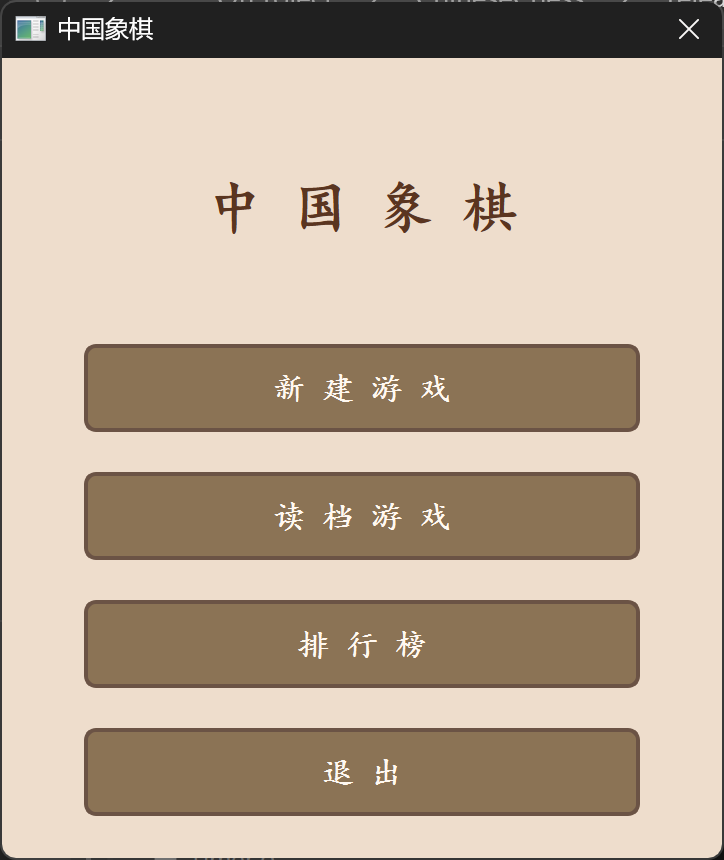
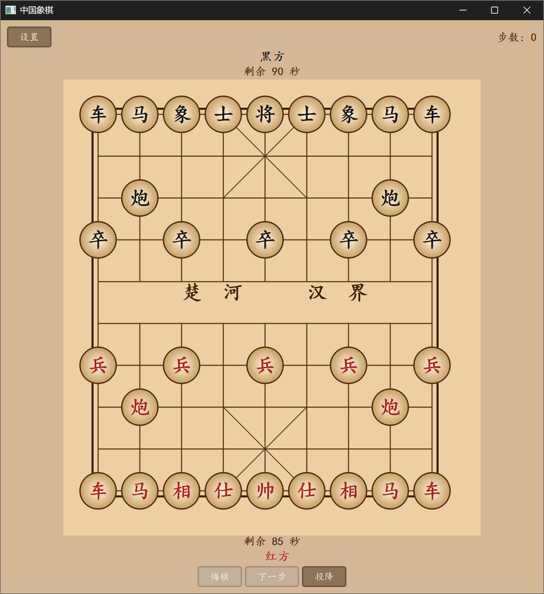

# 中国象棋 Chinese Chess

C++ 实现的中国象棋游戏，包含控制台版和 Qt GUI 版两个版本。

## 截图

### 初始菜单



### 游戏界面



## 功能

- 完整中国象棋规则（走子、吃子、将军、将死判定）
- 90 秒倒计时（每步限时）
- 悔棋 / 重做
- 鼠标点击走棋（Qt 版）+ 坐标/中文记谱法输入（控制台版）
- 游戏存档 / 读档（含步法记录，读档后可悔棋）
- 排行榜（胜率排序）
- 传统中文记谱法（炮二平五、马三进四）
- 玩家注册系统（数字 ID 映射，避免中文文件名编码问题）

## 项目结构

```
├── main.cpp              # 程序入口
├── ChineseChess.pro      # qmake 项目文件
├── include/              # 头文件
│   ├── Game.h            # 游戏逻辑主类
│   ├── Board.h           # 棋盘类
│   ├── ChessPiece.h      # 棋子抽象基类
│   ├── King.h / Advisor.h / Elephant.h / Knight.h / Rook.h / Cannon.h / Pawn.h
│   ├── SaveManager.h     # 存档/排行榜管理
│   ├── Timer.h           # 计时器
│   ├── boardwidget.h     # Qt 棋盘控件
│   ├── mainwindow.h      # Qt 主窗口
│   ├── initialdialog.h   # 初始菜单
│   ├── newgamedialog.h   # 新建游戏
│   ├── loadgamedialog.h  # 读档选择
│   └── leaderboarddialog.h # 排行榜
└── src/                  # 源文件
    ├── Game.cpp / Board.cpp / ChessPiece.cpp ...
    ├── boardwidget.cpp   # 棋盘绘制 + 鼠标交互
    ├── mainwindow.cpp    # 主界面布局 + 计时 + 控制
    └── [dialogs].cpp     # 各对话框实现
```

**控制台版**：见仓库 `master` 分支

## 环境要求

| 组件 | 版本 |
|------|------|
| Qt | 6.11.0 (QtWidgets) |
| 编译器 | MinGW GCC 16.1 (MSYS2) |
| 构建工具 | qmake6 + mingw32-make |
| 操作系统 | Windows |

## 构建方法

### 1. 安装 MSYS2 及依赖

```bash
# 在 MSYS2 MinGW64 终端中执行：
pacman -S mingw-w64-x86_64-qt6-base mingw-w64-x86_64-gcc mingw-w64-x86_64-make
```

### 2. 编译

**方式一：Qt Creator**

打开 `ChineseChess.pro`，选择 MSYS2 MinGW Kit，`Ctrl+B` 编译。

**方式二：命令行**

```bash
# 在 MSYS2 MinGW64 终端中执行：
qmake6
mingw32-make -j4
# 生成 release/ChineseChess.exe
```

### 3. 运行

在 `release/` 目录下双击 `ChineseChess.exe`，或从 Qt Creator 按 `Ctrl+R` 运行。

## 游戏规则

- 红方先行，轮流走棋
- 每步限时 90 秒，超时判负
- 将死对方将/帅即获胜
- 己方被将军时必须应将
- 将帅不能在同列无阻挡（飞将规则）

## 操作说明

### Qt GUI 版

| 操作 | 方式 |
|------|------|
| 走棋 | 点击己方棋子 → 点击目标位置 |
| 悔棋 | 点击底部 [悔棋] 按钮 |
| 重做 | 点击底部 [下一步] 按钮 |
| 保存 | [设置] → 保存游戏 |
| 读档 | 启动界面 → 读档游戏 |
| 排行榜 | 启动界面 / [设置] → 排行榜 |

### 控制台版

| 操作 | 按键 |
|------|------|
| 走棋 | 输入坐标 (x1 y1 x2 y2) 或中文记谱法 (炮二平五) |
| 悔棋 | U |
| 重做 | R |
| 保存 | S |
| 读档 | L |
| 认输 | F |
| 和棋 | P |

## 存档文件

存档保存在 `saves/` 目录，格式为 `{红ID}_vs_{黑ID}_play{编号}.txt`，纯 ASCII 命名避免编码问题。存档包含当前棋盘状态和完整步法记录，读档后可正常悔棋。

## 许可证

仅供学习交流使用。
